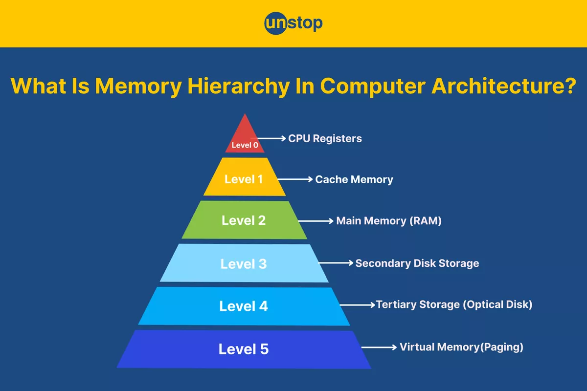

Speed Kills. Usually that is how the phrase goes, but in this blog we won't be talking about road traffic accidents. We will talk about CPUs and the memory hierarchy. The CPU executes instructions and memory stores data. In a modern computer system, there are several storage technologies with varying speeds and storage capacities.

The image below compares the various storage technologies in terms of speed and storage capacity. This is termed as **_memory hierarchy_**. As you climb up the pyramid, memory storage becomes **smaller, faster and costlier per byte**. In real life, you can relate it to vehicles. I don’t know much about cars, but I know this for sure--buses are cheaper and can hold more people than a Ferrari, but a Ferrari is faster and more expensive. So what...??


_Image credit: “Memory Hierarchy in Computer Architecture,” Unstop blog_

There are a lot of things that can affect a program’s performance. One often-ignored factor is memory and how we access it. Hardware designers made it possible to have your data in a slower, bigger memory and still enjoy the speed of a faster, smaller memory called **_cache_**. In the beginning of the post, I wrote that the CPU executes instructions — but most of the time these instructions have operands (data). And where do these operands live? Obviously in memory. What do you think will happen if the CPU needs to read data from slower memory? It **_waits_**, until the data is ready to be used.

Program performance can generally fall into two categories:  
_How much harder is the CPU put to work_ and _How long does the CPU wait for data_.

### A Tale of Two Stories

Now let's take a look at the following code that sums up the elements in a 2D array:

```c
int sumarrayrows(int a[M][N]) {

    int i, j, sum = 0;

    for (i = 0; i < M; i++)
        for (j = 0; j < N; j++)
            sum += a[i][j];

    return sum;
}
```

This code has a nested loop that access all the elements of an array. It first starts by accessing the first row of the array `a[0]` and then access the elements in that row in the order `a[0][0]`, `a[0][1]` up to `a[0][N-1]` sequentially. The reference pattern of an array with `M=2` and `N=3` is as follows `0`, `1`, `2`, `3` ,`4`, `5`.

When a read request is issued by the CPU to memory, it gets the data it asked for, of course. But not only that, a block of data closely stored contiguously with the requested data which I call `neighbours` gets moved up, into a **cache**, in other words, into a Ferrari, hoping that the next CPU request comes their way soon.

Now let's breakdown what happens when the elements are accessed. For simplicity I will refer to the elements of our array by their index.
Let’s assume the following:

- _The ***cache*** can hold up to 3 elements at a given time._
- _The ***cache*** is empty._

`0`, `1`, `2` was copied into the faster memory after the initial read request of `0`. What happens when the CPU requests for `1` ?. `1` will be served to the CPU from the **_cache_** as well as `2` , with minimal wait time. This is termed as a **_cache hit_**.

Now let’s switch things up with another example.

```c
int sumarrayrows(int a[M][N]) {

    int i, j, sum = 0;

    for (i = 0; i < M; i++)
        for (j = 0; j < N; j++)
            sum += a[j][i];

    return sum;
}
```

This example logically does the same thing as our initial example but accesses memory in a different way.
The reference pattern of an array with `M=2` and `N=3` is as follows `0`,`3`,`1`, `4`, `2`,`5` .
`0` was requested `0`,`1`,`2` got moved up. `3` is requested , It can’t be found in the **_cache_** , this is termed a **_cache miss_**. What this means is that the CPU has to wait for `3` from a slower memory and also replaces the previous elements in the cache with `3`, `4`, `5`.

### Summary

Programs that access data sequentially in order as they are laid out in memory run faster than programs that don't, especially in large working data set. Such programs benefit from having data from fast cache memories rather than memory.
